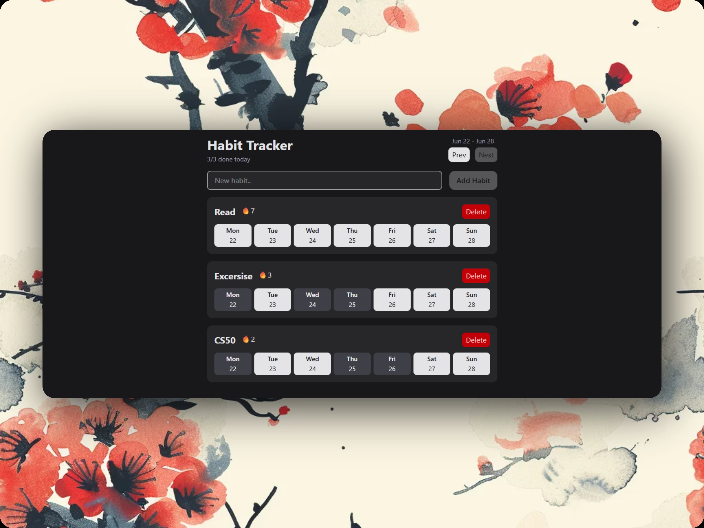

# Habit Tracker

A simple and modern Habit Tracker built with React and TypeScript to help users track their daily habits and maintain streaks.

## Live Demo

🔗 [View Live Link](https://habit-tracker-for-ts.vercel.app)

## Features

* ➕ Add new habits
* ❌ Delete existing habits
* ✅ Mark habits as completed for specific days
* 🔥 Dynamic streak calculation
* 📅 Navigate between previous and next weeks
* 💾 Persist data using localStorage
* 📱 Responsive UI
* 🎨 Reusable Button component with variants

## Tech Stack

* React
* TypeScript
* Tailwind CSS
* Context API
* date-fns
* tailwind-merge
* Vite

## Screenshots



## Getting Started

### Clone the repository

```bash
git clone https://github.com/abusufyan-03/habit-tracker.git

```

### Install dependencies

```bash
npm install
```

### Start the development server

```bash
npm run dev
```

## Project Structure

```txt
src/
├── components/
│   ├── Button.tsx
│   ├── HabitForm.tsx
│   ├── HabitList.tsx
│   └── Header.tsx
├── context/
│   ├── HabitProvider.tsx
│   └── useHabits.ts
├── hooks/
│   └── useLocalStorage.ts
├── App.tsx
└── main.tsx
```

## What I Learned

While building this project, I learned:

* Building reusable React components
* TypeScript fundamentals in real projects
* Using `ComponentProps` for component composition
* Creating component variants with TypeScript unions
* Using `tailwind-merge` to merge and override styles
* Managing global state using Context API
* Avoiding prop drilling
* Building custom hooks
* Persisting state with localStorage
* Using TypeScript Generics (`<T>`)
* Working with Date objects and `date-fns`
* Handling serialization/deserialization of Date objects
* Calculating streaks dynamically
* Managing state updates using functional updates

## Future Improvements

* Dark/Light mode toggle
* Authentication and cloud sync
* Drag and drop habit reordering

## Author

Built with ❤️ by Abu Sufiyan.
